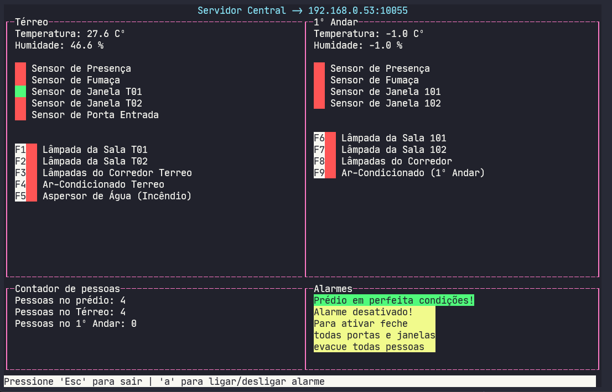

# FSE_Trabalho_2

Repositório para o [trabalho 2](https://gitlab.com/fse_fga/trabalhos-2021_2/trabalho-2-2021-2) da disciplina de Fundamentos de Sistemas Embarcados (FGA-UnB).

# Servidor central



## Dependências

* python3 (versão utilizada nos testes: 3.7.3)

## Como executar

```bash
cd central
chmod +x app.py
./app.py <ip> <porta>
```

ou

```bash
cd central
python3 app.py <ip> <porta>
```

**Obs:** ```<ip>``` e ```<porta>``` utilizado por padrão no arquivo de configuração do servidor distribuído é respectivamente **192.168.0.53** e ***10055***

## Funcionamento

Após executar o servidor central estará a espera dos dois servidores distribuídos conectarem ao ```<ip>``` ```<porta>``` escolhida.

Após um servidor distribuído se conectar, o usuário poderá:

* ligar/desligar os dispositivos teclando a tecla correspondente a esquerda do dispositivo.
* ligar/desligar o alarme de segurança teclando a tecla **'a'**.
* Para sair pressione **'Esc'**.
* Um linha de log e gerado no arquivo **[log.csv](/central/log.csv)** para cada ativar/desativar dos dispositivos pelo usuário, também gera uma linha para ocorrência de acionamento dos alarmes de incêndio e de segurança

**Obs:**

* Quadrado vermelho = desligado
* Quadrado verde = ligado
* Após sair, os servidores distribuídos serão encerrados

# Servidor distribuído


## Dependências

* gcc (versão utilizada nos testes: c11)
* g++ (versão utilizada nos testes: c++17)
* [wiringPi](http://wiringpi.com/)
* make

## Como executar

```bash
cd distributed
make all
./bin <arquivo de configuração>
```

Obs: Para o parâmetro ```<arquivo de configuração>``` pode ser utilizado **[configuracao_andar_terreo.json](/distributed/configuracao_andar_terreo.json)** ou **[configuracao_andar_1.json](/distributed/configuracao_andar_1.json)**

## Funcionamento

Após executar o servidor distribuído estará a espera do servidor central para ser conectar.
